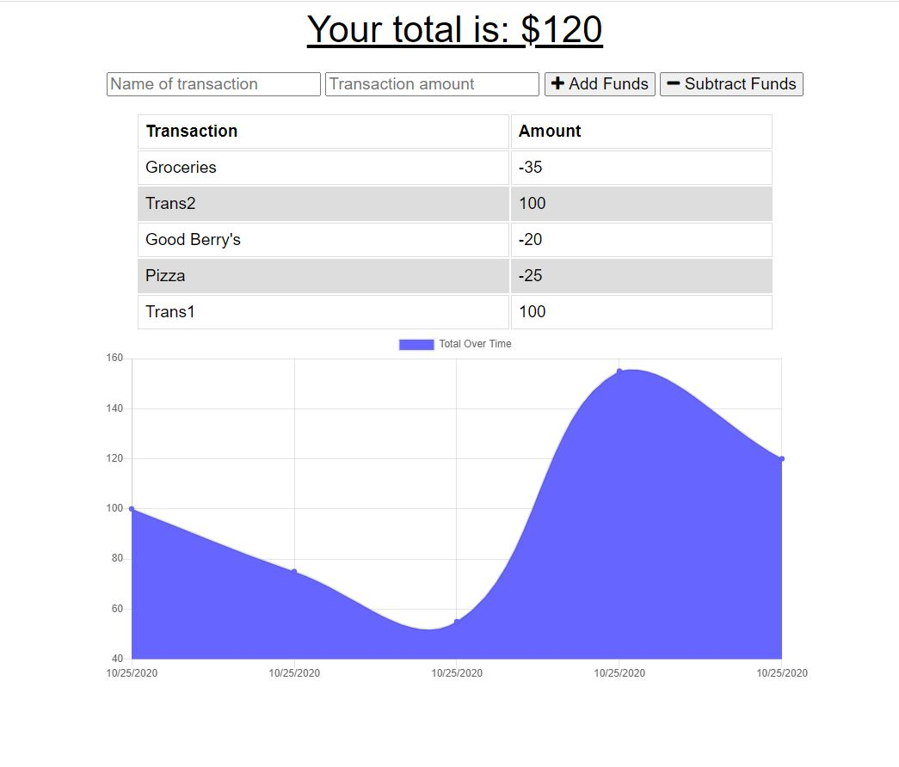
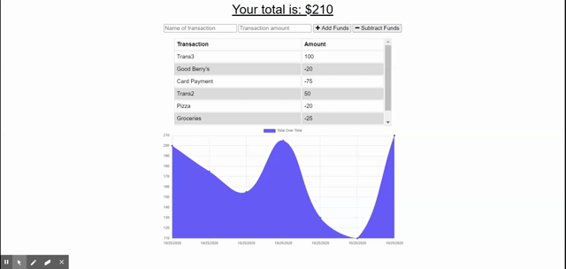

# pwa-offline-budget-tracker

## Description
Adding functionality to an existing Budget Tracker application to allow for offline access and functionality.  This budget tracker works even when the Netork settings are offline and as soon as the network setting are Online, stores the transactions in MongoDB. This app can be installed  on your phone or on PC.

Deployed in Heroku at https://vk-progressive-budget.herokuapp.com/

## Table of Contents
* [Installation](#installation)
* [Usage](#usage)
* [License](#license)
* [Contributing](#contributing)
* [Tests](#tests)
* [Questions](#questions)

## Installation
This application is located in GitHub at https://github.com/vkalaparthy/pwa-offline-budget-tracker and the application can be accessed from [heroku](https://vk-progressive-budget.herokuapp.com/).  When you open the Heroku app in Chrome, click the menu ⁝ at the top-right of its window and select install "OfflineBudgetTracker" and use the installed App.

## Usage
Install the app from Heroku https://vk-progressive-budget.herokuapp.com/  and start entering your trasactions.  You will be able to use this App whne Network is Online/Offline without loosing the transactions.  Since the App uses MongoDB, you need to have installed the MongoDb to store/retrieve the trasactions. 

  

You can clone the app from the GitHub repository from https://github.com/vkalaparthy/pwa-offline-budget-tracke to make any improvements or Run the app in Heroku, [here](https://vk-progressive-budget.herokuapp.com/)    
  
  
Demo:  
 
## License
Copyright © 2020-present, Vani Kalaparthy. Released under the MIT License.
## Contributing
## Tests

## Questions
* Vani Kalaparthy
  * https://github.com/vkalaparthy
  * kalaparthy.vani@gmail.com
